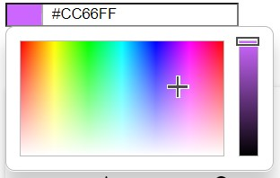
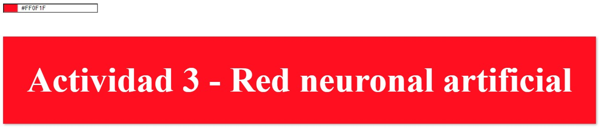
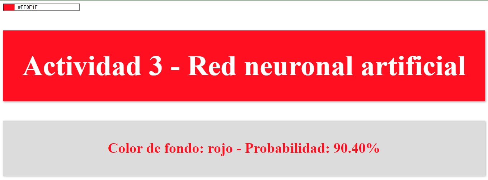

# Práctica Red Neuronal - Clasificación de Colores

## Contenidos

[Descripción del proyecto](#descripción-del-proyecto)
[Funcionalidades](#funcionalidades)
[Clasificación de Color](#clasificación-de-color)
[Instalación](#instalación)
[Uso](#uso)
[Configuración](#configuración)
[Discrepancias en la Clasificación de Colores](#discrepancias-en-la-clasificación-de-colores)
[Tecnologías Utilizadas](#tecnologías-utilizadas)

## Descripción del Proyecto

Este proyecto implementa una interfaz web simple que utiliza una red neuronal para clasificar y mostrar información sobre el color seleccionado por el usuario.

## Funcionalidades

Actualización en tiempo real: La interfaz se actualiza en tiempo real mientras el usuario selecciona diferentes colores.

## Clasificación de Color

El programa utiliza una red neuronal para clasificar el color seleccionado en categorías predefinidas como "verde", "azul", "rojo", etc.

## Instalación

### 1. Clonar el Repositorio:

```bash
## Copy code
git clone https://github.com/viorbe20/ai-artificial-intelligence-models.git
```

### 2. Abrir el Archivo HTML

Abre el archivo index.html en tu navegador favorito.

## Uso

### 1. Utiliza el control de selección de color para cambiar el fondo.



### 2. Observa cómo la interfaz se actualiza y la red neuronal aplica el color seleccionado al h1.



### 3. Un poco más abajo, otra red neuronal intentaré adivinar el color seleccionado y te indicará la probabilidad.



## Configuración

El programa establece un evento que se activa cuando se ha cargado completamente el DOM (DOMContentLoaded). 

Aquí hay un desglose de lo que hace cada parte del código:

### 1. Inicialización de variables:

*colorInput*: Obtiene el elemento del DOM con el ID "color-input".
*subtitleElement*: Obtiene el elemento del DOM con el ID "subtitle".

### 2. Evento de cambio de color

*addEventListener*: Este evento se activa cada vez que el valor del color de entrada cambia. Dentro de esta función, se llama a dos funciones: *update* y *classifyColor*.

### 3. Creacion de redes neuronales

Se crean dos redes neuronales se entrenan con conjuntos de datos específicos. *network* se entrena para determinar el color del texto en función del fondo, mientras que *classificatorNetwork* se entrena para clasificar colores en categorías específicas.

### 4. Funciones

*classifyColor*. Para determinar el color del texto según el fondo.

*update*. Para clasificar colores en categorías específicas. 

## Discrepancias en la Clasificación de Colores

El ejercicio tiene fines académicos por lo que la red neuronal no es lo suficientemente compleja como para capturar todas las variaciones posibles de colores. Debido a esto, existen algunas anomalías en la clasificación de colores. Además, algunos colores pueden ser difíciles de distinguir y podrían estar cerca en el espacio de características RGB.

## Tecnologías Utilizadas

- HTML
- CSS
- JavaScript (biblioteca brain.js)

## Contribuciones

Siéntete libre de contribuir al proyecto. Puedes abrir un problema o enviar una solicitud de extracción con mejoras o correcciones.

## Autora

Virginia Ordoño Bernier